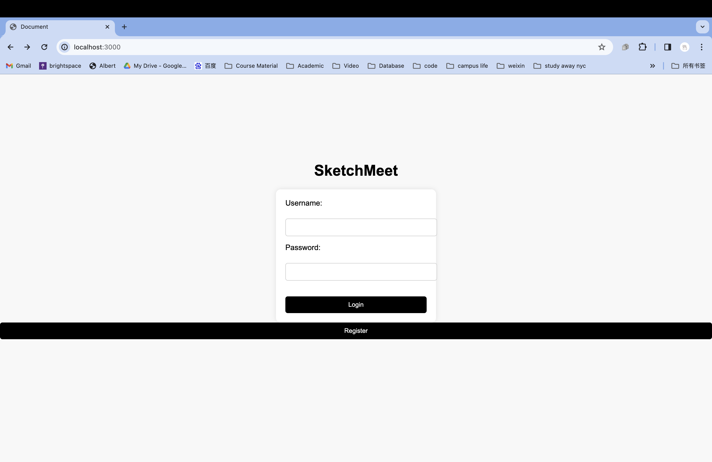
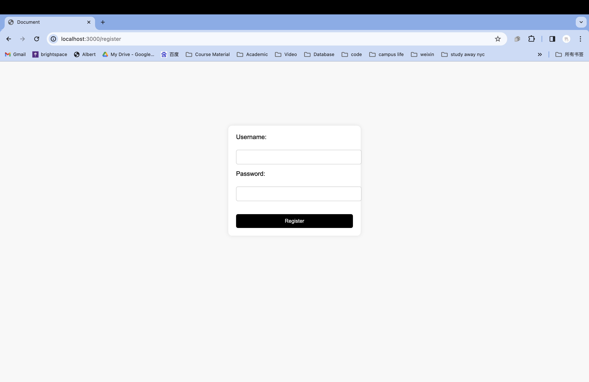
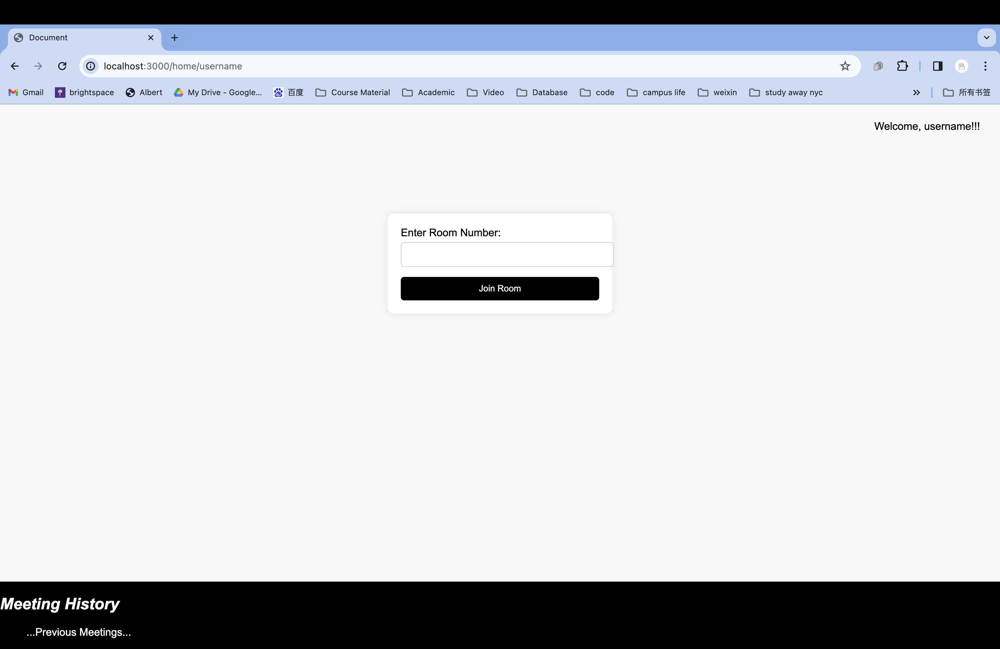
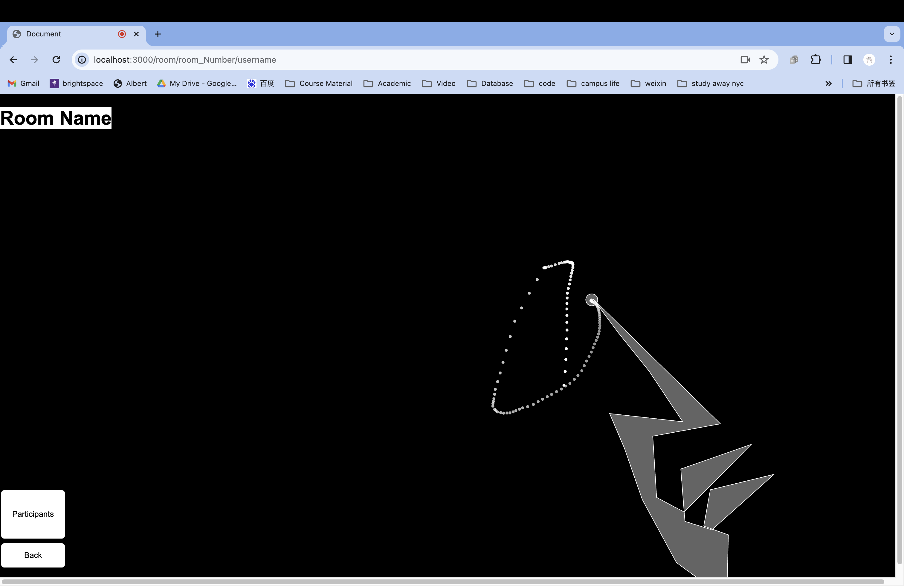
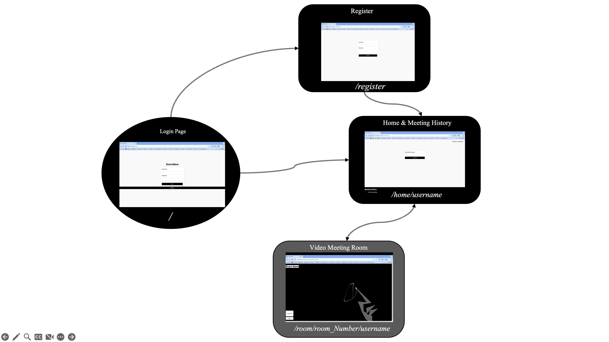

# SketchMeet

## Overview

It's often challenging to effectively convey ideas verbally during video meetings, and carrying an iPad around can be burdensome. That's where SketchMeet comes in!

In SketchMeet's video conference rooms, users can freely sketch or write in front of their cameras, with their creations instantly displayed on the screen in real-time.


## Data Model

The application will store Users, Meetings

* users can have multiple meetings (via references)
* each meeting can have multiple users (by embedding)


An Example User:

```javascript
{
  username: "shannonshopper",
  hash: // a password hash,
  meetings: // an array of references to meetings
}
```

An Example Meeting:

```javascript
{
  meetingID: "123456789",
  meetingName: "The First Try"
  users: // an array of references to users,
  startAt: // timestamp
  endAt: //timestamp
}
```


## [Link to Commented First Draft Schema](db.mjs) 


## Wireframes

(__TODO__: wireframes for all of the pages on your site; they can be as simple as photos of drawings or you can use a tool like Balsamiq, Omnigraffle, etc.)

/login - main page and for users logging in


/register - page for users signing up



/home/username - page for users entering their room and browsing their meeting history



/room/room_Number/username - page for users video meeting and drawing (or clearing the canvas) by finger pose



## Site map



## User Stories or Use Cases

1. As a participant, I want to engage in video conference rooms where I can visually express ideas beyond verbal communication so that I can enhance the clarity of my message.
2. As a collaborator, I want to see real-time sketches or writings from other participants so that I can better understand their ideas and contribute meaningfully to the discussion.
3. As a presenter, I want to share visual content instantly to illustrate complex concepts during discussions, so that I can engage and captivate the audience more effectively.
4. As a meeting organizer, I want attendees to have an alternative to carrying additional devices, such as iPads, to participate effectively, so that meetings can be more accessible and convenient for everyone.
5. As a remote worker, I want the flexibility to join collaborative sketching sessions from any device with a camera and internet connection, so that I can participate in productive discussions regardless of my location.


## Research Topics

* (5 points) Automated functional testing
    * It is a software testing method used to verify that an application's features function as expected.
    * It helps me ensure that new changes or updates to an application do not introduce regressions or break existing functionality and also save time for me.
    * Selenium, Headless Chrome, Puppeteer

* (3 points) a client-side JavaScript library
    * It is a set of tools and functionalities used to perform various tasks in the browser.
    * It enables me to build dynamic and engaging user interfaces and also simplifies complex tasks, improving overall development efficiency
    * [p5.js, Tensorflow.js, fingerpose](sketch.mjs)
* (3 points) webpack and use a CSS preprocesser
    * Webpack is a static module bundler for modern JavaScript applications, and a CSS preprocessor extends the CSS language with features.
    * Webpack optimizes assets for performance. A CSS preprocessor provides a more maintainable and organized way to write stylesheets.
    * Webpack, Sass

<!-- 10 points total out of 8 required points (___TODO__: addtional points will __not__ count for extra credit) -->

## [Link to Initial Main Project File](app.mjs) 

## Annotations / References Used

1. [MediaPipe Handpose](https://github.com/tensorflow/tfjs-models/blob/master/handpose/README.md)
2. [fingerpose](https://github.com/andypotato/fingerpose)
3. [p5.js](https://p5js.org/reference/)

